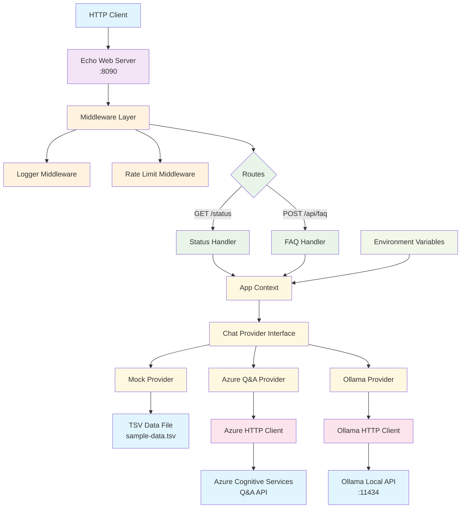

# Chat Backend

A Go-based FAQ chatbot backend with support for multiple chat providers including Azure Q&A, Ollama, and mock responses.

## Architecture



## Features

- **Multiple Chat Providers**: Support for Azure Q&A, Ollama, and mock responses
- **Streaming Support**: Ollama provider supports streaming responses
- **Rate Limiting**: Built-in rate limiting middleware
- **Structured Logging**: Using Go's structured logging
- **Environment-based Configuration**: Easy provider switching via environment variables

## Configuration

The application uses the `CHAT_PROVIDER` environment variable to determine which provider to use:

### Mock Provider (Default)
```bash
CHAT_PROVIDER=mock
```
- Uses local TSV data file for responses
- Fallback responses when TSV file is unavailable

### Azure Q&A Provider
```bash
CHAT_PROVIDER=azure-qa
AZURE_QNA_ENDPOINT=https://your-service.cognitiveservices.azure.com
AZURE_QNA_API_KEY=your-api-key
AZURE_QNA_PROJECT_NAME=your-project
AZURE_QNA_DEPLOYMENT_NAME=your-deployment
```

### Ollama Provider
```bash
CHAT_PROVIDER=ollama
OLLAMA_BASE_URL=http://localhost:11434  # Optional, defaults to localhost:11434
OLLAMA_MODEL=mistral                    # Optional, defaults to mistral
```

